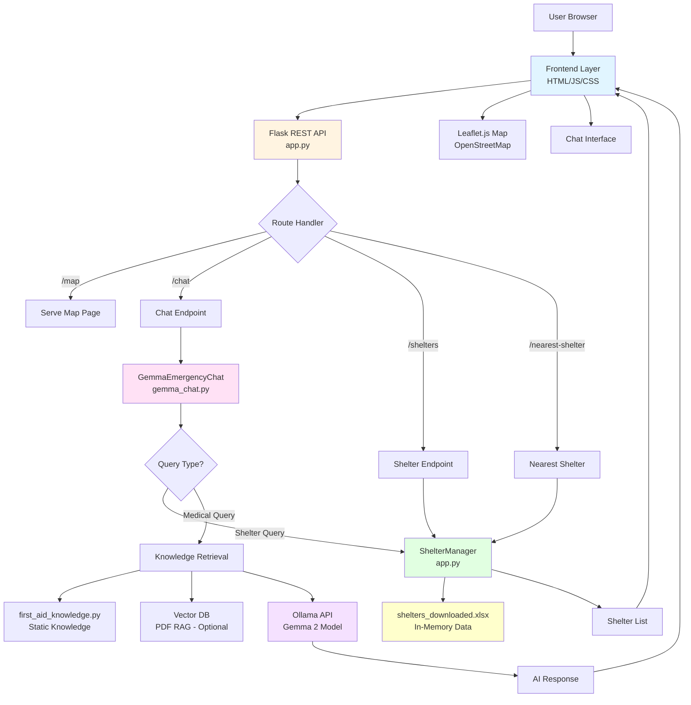
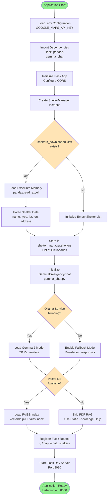
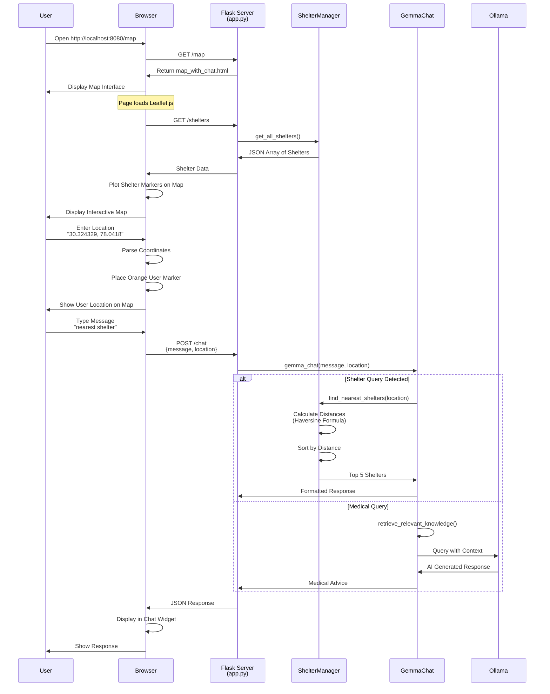
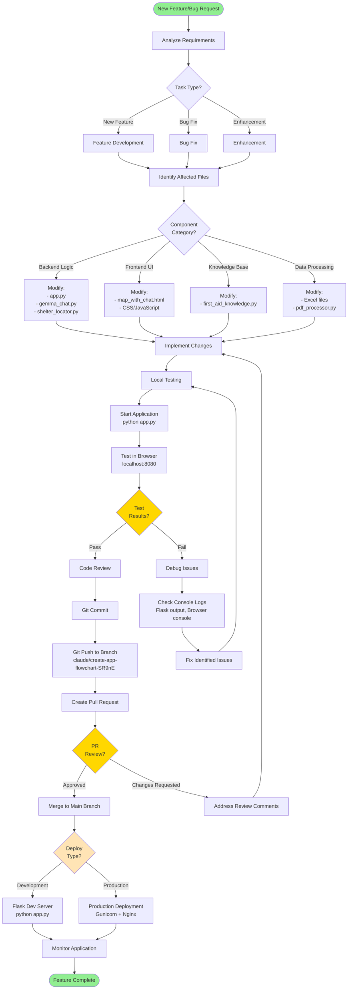
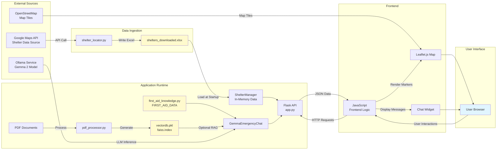
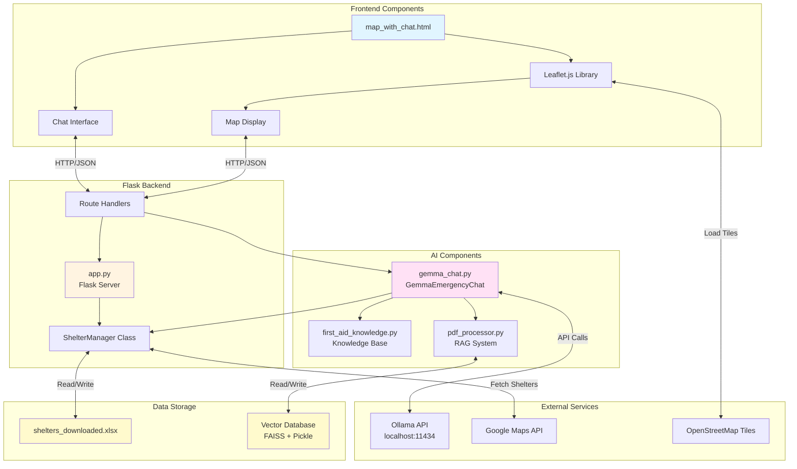
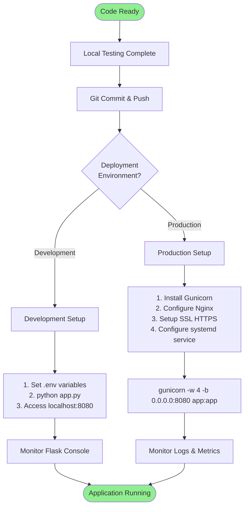

# Emergency Shelter & First Aid Assistant - Development Flowchart

## Table of Contents
1. [High-Level System Architecture](#1-high-level-system-architecture)
2. [Application Startup Flow](#2-application-startup-flow)
3. [User Request Flow](#3-user-request-flow)
4. [Chatbot Processing Flow](#4-chatbot-processing-flow)
5. [Shelter Search Flow](#5-shelter-search-flow)
6. [Map Rendering Flow](#6-map-rendering-flow)
7. [Development Workflow](#7-development-workflow)
8. [Data Flow Diagram](#8-data-flow-diagram)
9. [Component Interaction Diagram](#9-component-interaction-diagram)

---

## 1. High-Level System Architecture



---

## 2. Application Startup Flow



---

## 3. User Request Flow



---

## 4. Chatbot Processing Flow

```mermaid
flowchart TD
    Start([User Sends Message]) --> Receive[POST /chat Endpoint<br/>app.py]
    Receive --> Extract[Extract Data<br/>message, user_location]

    Extract --> CallGemma[Call gemma_chat.chat<br/>gemma_chat.py]
    CallGemma --> DetectType{Query Type<br/>Detection}

    DetectType -->|"nearest shelter"<br/>"find shelter"| ShelterQuery[Shelter Query Detected]
    DetectType -->|Medical Keywords| MedicalQuery[Medical Query Detected]
    DetectType -->|General| GeneralQuery[General Query]

    ShelterQuery --> HasLocation{User Location<br/>Provided?}
    HasLocation -->|Yes| ImportShelterMgr[Import shelter_manager<br/>from app.py]
    HasLocation -->|No| NoLocationError[Return Error:<br/>"Please provide location"]

    ImportShelterMgr --> FindNearest[find_nearest_shelters<br/>latitude, longitude]
    FindNearest --> CalcDistance[Calculate Distance for Each Shelter<br/>Haversine Formula]

    CalcDistance --> SortShelters[Sort Shelters by Distance<br/>Ascending Order]
    SortShelters --> Top5[Select Top 5 Shelters]
    Top5 --> FormatShelter[Format Response:<br/>Name, Type, Distance, Address]
    FormatShelter --> ReturnShelter[Return Shelter List]

    MedicalQuery --> KeywordExtract[Extract Medical Keywords<br/>bleeding, burn, CPR, etc.]
    KeywordExtract --> SearchKnowledge{Search Knowledge<br/>Sources}

    SearchKnowledge --> StaticKnowledge[Search first_aid_knowledge.py<br/>FIRST_AID_DATA Dictionary]
    SearchKnowledge --> VectorSearch{Vector DB<br/>Available?}

    VectorSearch -->|Yes| FAISSSearch[FAISS Semantic Search<br/>vectordb.pkl]
    VectorSearch -->|No| SkipVector[Skip Vector Search]

    StaticKnowledge --> CombineContext[Combine Knowledge Contexts]
    FAISSSearch --> CombineContext
    SkipVector --> CombineContext

    CombineContext --> BuildPrompt[Build Ollama Prompt<br/>System + User + Context]
    BuildPrompt --> CheckOllama{Ollama<br/>Available?}

    CheckOllama -->|Yes| QueryOllama[POST http://localhost:11434/api/chat<br/>Model: gemma2:2b]
    CheckOllama -->|No| FallbackResponse[Return Static Knowledge<br/>Rule-based Response]

    QueryOllama --> StreamResponse[Stream Response Chunks]
    StreamResponse --> ParseAI[Parse AI Response]
    ParseAI --> FormatMedical[Format Medical Advice]

    GeneralQuery --> BuildPrompt

    FormatMedical --> ReturnResponse[Return to Flask Endpoint]
    FallbackResponse --> ReturnResponse
    ReturnShelter --> ReturnResponse
    NoLocationError --> ReturnResponse

    ReturnResponse --> SendJSON[Send JSON to Frontend]
    SendJSON --> End([Display in Chat Widget])

    style Start fill:#90EE90
    style End fill:#90EE90
    style DetectType fill:#FFD700
    style HasLocation fill:#FFD700
    style SearchKnowledge fill:#FFD700
    style VectorSearch fill:#FFE4B5
    style CheckOllama fill:#FFE4B5
```

---

## 5. Shelter Search Flow

```mermaid
flowchart TD
    Start([Shelter Search Request]) --> Input[Input: User Location<br/>latitude, longitude]
    Input --> GetShelters[Get All Shelters<br/>shelter_manager.shelters]

    GetShelters --> CheckEmpty{Shelters<br/>List Empty?}
    CheckEmpty -->|Yes| NoShelters[Return: No shelters available]
    CheckEmpty -->|No| IterateShelters[Iterate Through Each Shelter]

    IterateShelters --> LoopStart{For Each<br/>Shelter}
    LoopStart --> ExtractCoords[Extract Shelter Coordinates<br/>shelter_lat, shelter_lon]

    ExtractCoords --> Haversine[Calculate Distance<br/>Haversine Formula]

    Haversine --> Formula[Formula Steps:<br/>1. Convert degrees to radians<br/>2. Calculate Δlat, Δlon<br/>3. Calculate a = sin²(Δlat/2)<br/>   + cos(lat1) * cos(lat2) * sin²(Δlon/2)<br/>4. Calculate c = 2 * atan2(√a, √(1-a))<br/>5. Distance = R * c<br/>R = 6371 km Earth radius]

    Formula --> StoreDistance[Store Distance with Shelter Data<br/>shelter['distance'] = distance_km]
    StoreDistance --> MoreShelters{More<br/>Shelters?}

    MoreShelters -->|Yes| LoopStart
    MoreShelters -->|No| SortByDistance[Sort Shelters by Distance<br/>Ascending Order]

    SortByDistance --> SelectTop[Select Top N Shelters<br/>Default: 5]
    SelectTop --> FormatResponse[Format Each Shelter:<br/>- Name<br/>- Type<br/>- Distance km<br/>- Address<br/>- Rating<br/>- Status]

    FormatResponse --> ReturnList[Return Shelter List<br/>JSON Array]
    NoShelters --> ReturnList
    ReturnList --> End([Response to User])

    style Start fill:#90EE90
    style End fill:#90EE90
    style Haversine fill:#FFB6C1
    style Formula fill:#FFE4E1
```

---

## 6. Map Rendering Flow

```mermaid
flowchart TD
    Start([Page Load: map_with_chat.html]) --> LoadHTML[Load HTML Content]
    LoadHTML --> LoadCSS[Load CSS Styles<br/>Leaflet CSS from CDN]
    LoadCSS --> LoadJS[Load JavaScript<br/>Leaflet.js 1.9.4]

    LoadJS --> InitMap[Initialize Leaflet Map<br/>L.map'map']
    InitMap --> SetView[Set Default View<br/>Center: 30.3165, 78.0322<br/>Zoom: 13]

    SetView --> AddTiles[Add OpenStreetMap Tiles<br/>L.tileLayer]
    AddTiles --> TileURL[Tile URL:<br/>https://tile.openstreetmap.org/&#123;z&#125;/&#123;x&#125;/&#123;y&#125;.png]

    TileURL --> FetchShelters[Fetch Shelters<br/>GET /shelters]
    FetchShelters --> WaitResponse{API<br/>Response?}

    WaitResponse -->|Success| ParseJSON[Parse JSON Response<br/>Array of Shelter Objects]
    WaitResponse -->|Error| ShowError[Show Error in Console<br/>Continue with Empty Map]

    ParseJSON --> IterateShelters[Iterate Through Shelters]
    IterateShelters --> LoopStart{For Each<br/>Shelter}

    LoopStart --> ExtractData[Extract Shelter Data:<br/>- name<br/>- type<br/>- latitude<br/>- longitude<br/>- address]

    ExtractData --> DetermineColor{Determine<br/>Marker Color}
    DetermineColor -->|type = 'school'| BlueMarker[Color: Blue]
    DetermineColor -->|type = 'police'| GreenMarker[Color: Green]
    DetermineColor -->|type = 'fire_station'| RedMarker[Color: Red]
    DetermineColor -->|other| GrayMarker[Color: Gray]

    BlueMarker --> CreateMarker[Create Leaflet Marker<br/>L.marker[lat, lon]]
    GreenMarker --> CreateMarker
    RedMarker --> CreateMarker
    GrayMarker --> CreateMarker

    CreateMarker --> AddIcon[Add Custom Icon<br/>L.divIcon with color]
    AddIcon --> CreatePopup[Create Popup Content<br/>HTML with shelter details]
    CreatePopup --> BindPopup[Bind Popup to Marker<br/>marker.bindPopup]
    BindPopup --> AddToMap[Add Marker to Map<br/>marker.addTo(map)]

    AddToMap --> MoreShelters{More<br/>Shelters?}
    MoreShelters -->|Yes| LoopStart
    MoreShelters -->|No| EnableInteraction[Enable Map Interactions<br/>Pan, Zoom, Click]

    ShowError --> EnableInteraction

    EnableInteraction --> WaitUser{User<br/>Interaction?}

    WaitUser -->|Click Marker| ShowPopup[Display Shelter Popup<br/>with Details]
    WaitUser -->|Enter Location| SetUserLocation[Place Orange User Marker<br/>Center Map on Location]
    WaitUser -->|Zoom/Pan| UpdateView[Update Map View<br/>Load New Tiles if Needed]

    ShowPopup --> WaitUser
    SetUserLocation --> WaitUser
    UpdateView --> WaitUser

    style Start fill:#90EE90
    style DetermineColor fill:#FFD700
    style CreateMarker fill:#87CEEB
```

---

## 7. Development Workflow



---

## 8. Data Flow Diagram



---

## 9. Component Interaction Diagram



---

## Development Quick Reference

### Key Files by Function

| Function | Primary Files | Secondary Files |
|----------|--------------|-----------------|
| **Frontend UI** | `map_with_chat.html` | `index.html`, `medical_info.html` |
| **Backend API** | `app.py` | - |
| **AI Chatbot** | `gemma_chat.py` | `chatbot.py` (deprecated) |
| **Knowledge Base** | `first_aid_knowledge.py` | - |
| **Shelter Management** | `app.py` (ShelterManager) | `shelter_locator.py` |
| **Data Storage** | `shelters_downloaded.xlsx` | `shelters_01.xlsx` |
| **Vector Search** | `pdf_processor.py` | `vectordb.pkl`, `faiss.index` |
| **Map Generation** | `offline_map_plotter.py` | - |

### Common Development Tasks

1. **Add New Medical Knowledge**
   - Edit: `first_aid_knowledge.py`
   - Add entry to `FIRST_AID_DATA` dictionary
   - Restart application

2. **Update Shelter Data**
   - Run: `python shelter_locator.py`
   - Updates: `shelters_downloaded.xlsx`
   - Restart application to reload

3. **Modify Chat Behavior**
   - Edit: `gemma_chat.py`
   - Modify `detect_shelter_query()` or `chat()` method
   - Test with various queries

4. **Change Map Appearance**
   - Edit: `map_with_chat.html`
   - Modify Leaflet initialization
   - Update marker colors/icons

5. **Add New API Endpoint**
   - Edit: `app.py`
   - Add route with `@app.route()`
   - Update frontend to call new endpoint

### Testing Checklist

- [ ] Application starts without errors
- [ ] Map loads with shelter markers
- [ ] User location can be set
- [ ] Chatbot responds to medical queries
- [ ] Shelter search returns nearest locations
- [ ] Distance calculations are accurate
- [ ] Ollama integration works (if available)
- [ ] Vector search works (if enabled)
- [ ] All routes return proper responses
- [ ] CORS is configured correctly

---

## Deployment Flow



---

## Notes

- All flowcharts use Mermaid syntax for rendering in GitHub and compatible viewers
- Diagrams are organized by functional areas for easy reference
- Color coding indicates different component types:
  - 🟢 Green: Start/End states
  - 🟡 Yellow: Decision points
  - 🔵 Blue: Frontend components
  - 🟠 Orange: Backend components
  - 🟣 Purple: AI/ML components
  - 🟤 Tan: Data storage

For detailed architecture documentation, see [ARCHITECTURE.md](ARCHITECTURE.md)
